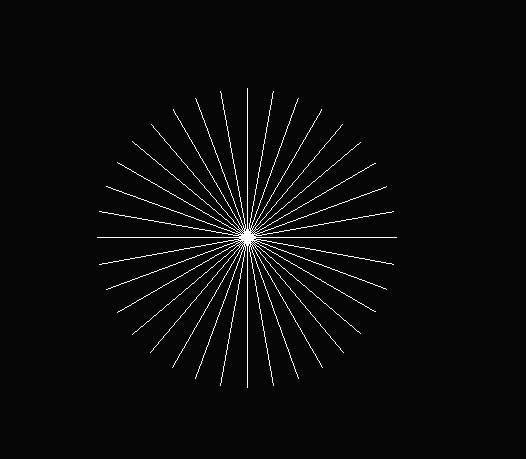
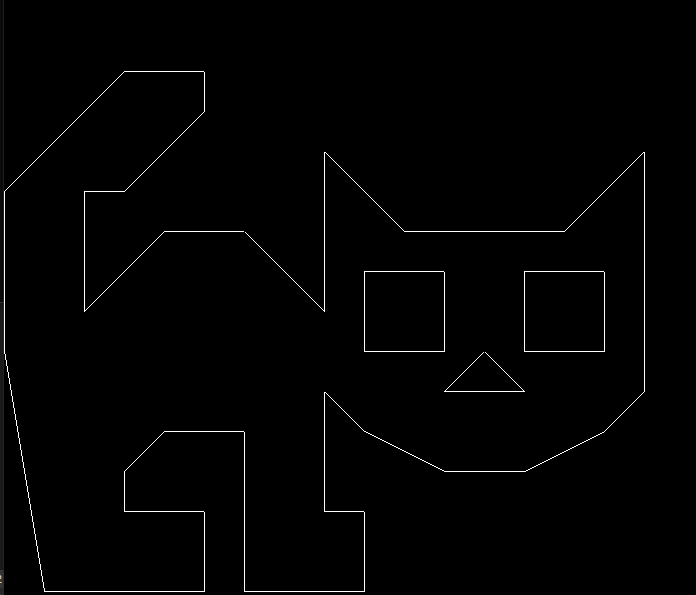

# Assignment1Report

In order to implement the **Bresenham's line algorithm**, we used the Wikipedia link providend in the code as a resource.
Two more functions were implemented as auxiliary functions to help with the main functions and avoid repeating code.

As a sanity check, we drew a circle to check if our function works correctly with every line and degree possible.
This is the result:




As an extra, we drew a cat using the line function we implemented. This is the result:



This is the implementation of the **Bresenham's line algorithm**:

```sh
void Renderer::DrawLineHigh(const glm::ivec2& p1, const glm::ivec2& p2, const glm::vec3& color) {
	float dx = p2.x - p1.x;
	float dy = p2.y - p1.y;
	int xi = 1;
	float d, x;

	if (dx < 0) {
		xi = -1;
		dx = ((-1) * dx);
	}

	d = (2 * dx) - dy;
	x = p1.x;
	for (int y = p1.y; y < p2.y; y++) {
		PutPixel(x, y, color);
		if (d > 0) {
			x += xi;
			d += (2 * (dx - dy));
		}
		else {
			d += (2 * dx);
		}
	}
}

void Renderer::DrawLineLow(const glm::ivec2& p1, const glm::ivec2& p2, const glm::vec3& color) {
	float dx = p2.x - p1.x;
	float dy = p2.y - p1.y;
	int yi = 1;
	float d, y;

	if (dy < 0) {
		yi = -1;
		dy = ((-1) * dy);
	}

	d = (2 * dy) - dx;
	y = p1.y;
	for (int x = p1.x; x < p2.x; x++) {
		PutPixel(x, y, color);
		if (d > 0) {
			y += yi;
			d += (2 * (dy - dx));
		}
		else {
			d += (2 * dy);
		}
	}
}

void Renderer::DrawLine(const glm::ivec2& p1, const glm::ivec2& p2, const glm::vec3& color)
{
	// bresenham algorithm https://en.wikipedia.org/wiki/Bresenham%27s_line_algorithm

	float dx = abs(p1.x - p2.x);
	float dy = abs(p1.y - p2.y);
	
	if (dy < dx) {
		if (p1.x > p2.x){
			DrawLineLow(p2, p1, color);
			return;
		}
		else {
			DrawLineLow(p1, p2, color);
			return;
		}
	}
	else {
		if (p1.y > p2.y) {
			DrawLineHigh(p2, p1, color);
			return;
		}
		else {
			DrawLineHigh(p1, p2, color);
			return;
		}
	}


}
```