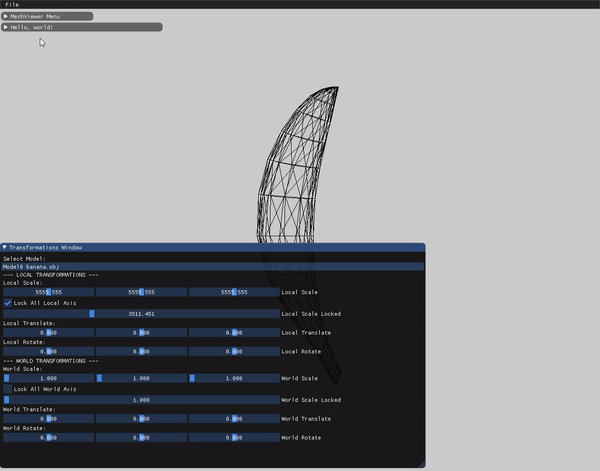

# Assignment1Report_part2

We added a print statement to the code as asked to see that the function reads the file and returns the right content from the obj file.

```c++
// based on the type parse data
		if (lineType == "v")
		{
			vertices.push_back(Utils::Vec3fFromStream(issLine));
            std::cout << issLine.str() << std::endl;
		}
		else if (lineType == "vn")
		{
			normals.push_back(Utils::Vec3fFromStream(issLine));
		}
		else if (lineType == "vt")
		{
			// TODO: Handle texture coordinates
		}
		else if (lineType == "f")
		{
			faces.push_back(Face(issLine));
            std::cout << issLine.str() << std::endl;
		}
		else if (lineType == "#" || lineType == "")
		{
			// comment / empty line
		}
		else
		{
			std::cout << "Found unknown line Type \"" << lineType << "\"";
		}
```
This is the output of the function (also the faces were printed down in the cmd window):


**In order to fit the object in the window, we added a scale factor to the vertices and translated the object to the center of the window.**

##

## Translate:
In the render function, before we called the DrawLine function, we moved the (x, y) coordinates of the object to the center of the window by adding half_width and half_height of the window to the coordinates.
```c++
v1.x += half_width;
v2.x += half_width;
v3.x += half_width;

v1.y += half_height;
v2.y += half_height;
v3.y += half_height;
```

## Scaling:
In the constructor of the MeshModel, we calculated the maximum coordinates of the model. We then calculated the scale factor to fit the model in the window by dividing 500 (half of the width) by the maximum coordinates of the model.

We saved the scalingFactor as the initial value of the local scaling matrix.
```c++
for (int i = 0; i < vertices.size(); i++) {
		x = vertices[i].x;
		y = vertices[i].y;
		z = vertices[i].z;

		// get maximum
		if (x > max) {
			max = x;
		}
		if (y > max) {
			max = y;
		}
		if (z > max) {
			max = z;
		}

		// get minimum
		if (x < min) {
			min = x;
		}
		if (y < min) {
			min = y;
		}
		if (z < min) {
			min = z;
		}
	}

	max = abs(max);
	min = abs(min);

	if (min > max)
		max = min;

	float scaleFactor = 500.0f / max;
	localScaleArray[0] = scaleFactor;
	localScaleArray[1] = scaleFactor;
	localScaleArray[2] = scaleFactor;
```


After that, we iterated over the faces to get its vertices and calculate the new coordinates of the vertices by mutiplying the vector by the final transformation matrix.

For each model, the transformation matrix is calculated by multiplying the global transformation matrix by the local transformation matrix as shown in the code below:

```c++
objectTransform = localTranslateMat * localRotateXMat * localRotateYMat * localRotateZMat * localScaleMat;

worldTransform = worldTranslateMat * worldScaleMat  * worldRotateXMat * worldRotateYMat * worldRotateZMat;

return worldTransform * objectTransform;
```

Now we are able to draw the object on the screen.

**banana.obj:**


## GUI Items:


The first item in the GUI enables you to select which object to apply the transformations to.

In the Local Transformations area, you can scale, translate and rotate the object around the x, y and z axis independently. We also added a checkbox to enable/disable the ability to scale the object in the x, y and z axis uniformly. This is done by checking the checkbox and using the single slider below it.

The same was done to the World Transformations area.

We also implemented mouse interactions on the object directly. Clicking and dragging the mouse will rotate the object around the x, y and z axis.

Keyborad interactions are also implemented. Pressing the 'w' key will translate the object up, the 's' key will translate the object down, the 'a' key will translate the object left and the 'd' key will translate the object right (locally).

**Here is a gif to show the GUI interactions:**


**Here is a gif to show the mouse and keyboard (w,a,s,d) interactions:**


## World vs Local Transformations:

The concept is that there are 2 seperate axis systems. The local transformations are applied to the object and the world transformations are applied to the world.

The local axis system is always centered in the middle of the object, so every transformation is relative to the object.

The world axis system is always centered in the middle of the window, so every transformation is relative to the window.

**local translate and world rotate:**
Here we are rotating the object around itself and its world positioning is irrelevant to the rotation.



Here we are rotating the object relative to a the axis centered in the middle of the window (world).

**world translate and local rotate:**

