# Assignment1Report_part3

## _TL;DR:_

In this part, we implemented a camera with orthographic and perspective projection, drown a model with its axis and the world axis, picked parameters for the camrra such that it is centered with the object in the middle of the screen, added local and world transformations to the camera, supported multiple cameras with different projection types and each camera can see other cameras relative to their position and orientation, and finally we updated the UI such that every parameter can be modified by the user.

**The UI consists of 3 main tabs:**

**General:** Here the user can change the background color and can see the current FPS of the application.

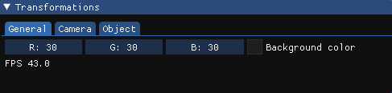

**Camera:** Here the user can add multiple cameras to the scene, select a camera to get its POV, and change the camera's parameters like position, orientation, and projection type.

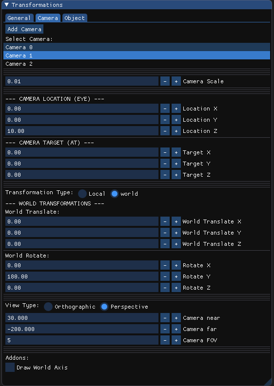

**Object:** Here the user can add multiple objects to the scene, select an object to get its parameters, and change the object's parameters like position, location, and scale. Also, the user can draw the faces and vertices normals and scale them according to the user's choice.

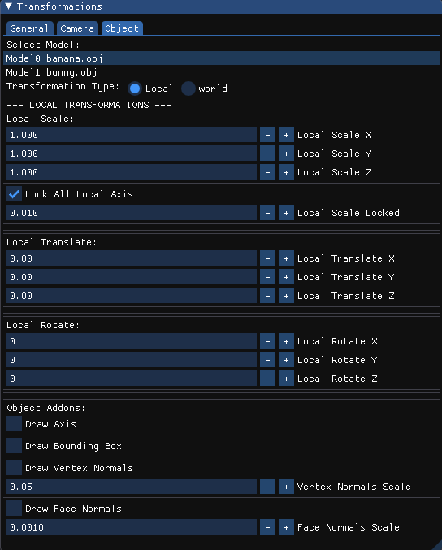

##

First, we implemented a camera with orthographic projection. We added the ability to change the up, down, left, right near and far values in the UI. In the orthographic projection, the near and far values don't affect the projection.


We moved the object to the middle of the screen by using this formula(as seen in last year's recordings):

point.x = (point.x + 1) \* half_width;

point.y = (point.y + 1) \* half_height;

##

We let the user resize the window while the object is still centered in the middle of the window.

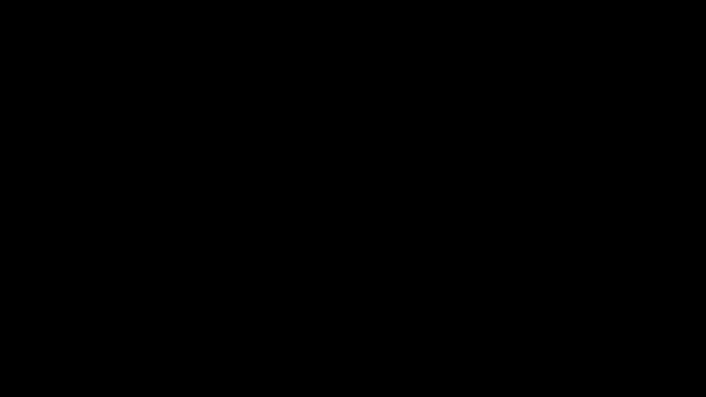

##

We implemented local and world axis. We added the ability to display them in the UI. A gif is shown below:


##

Here we demonstrated two transformations and how they are not commutative.

1. Translate in the local axis and rotate in the world axis.


2. Translate in the world axis and rotate in the local axis.


##

We drew vertex and face normals. We added the ability to display and scale them in the UI. A gif is shown below:


The **vertecis normals** are found in the "obj" file, so from each vertex we drew a line in the direction of the normal.

We calculated **faces normals** by ourselves. This is the formula that we used (p1, p2 and p3 are the points of the triangle/face):

```c++
glm::vec3 U = p2 - p1;
glm::vec3 V = p3 - p1;

float x = (U.y * V.z) - (U.z * V.y);
float y = (U.z * V.x) - (U.x * V.z);
float z = (U.x * V.y) - (U.y * V.x);
```

We also added a bounding box:


##

Now we implemented the perspective projection. We added the ability to change the fov, near and far values in the UI. In the perspective projection, the near and far values affect the projection.

Here is a comparison between translating in the z axis in the orthographic and perspective projection:

**orthographic:**

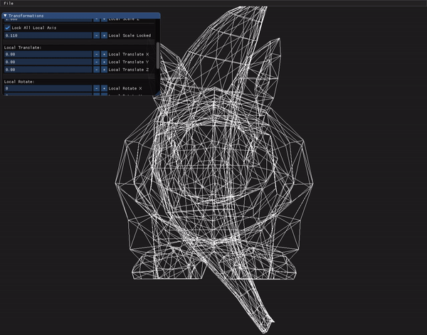

**perspective:**

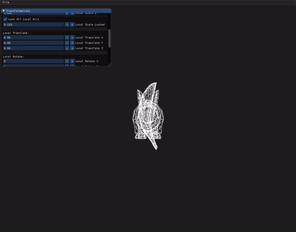

We can clearly see that in the perspective projection, the object gets closer to the camera as we translate to the positive z axis.

##

**camera close / frustrum small**

Here, we can se a more agressive 3D effect by having a smaller frustrum.

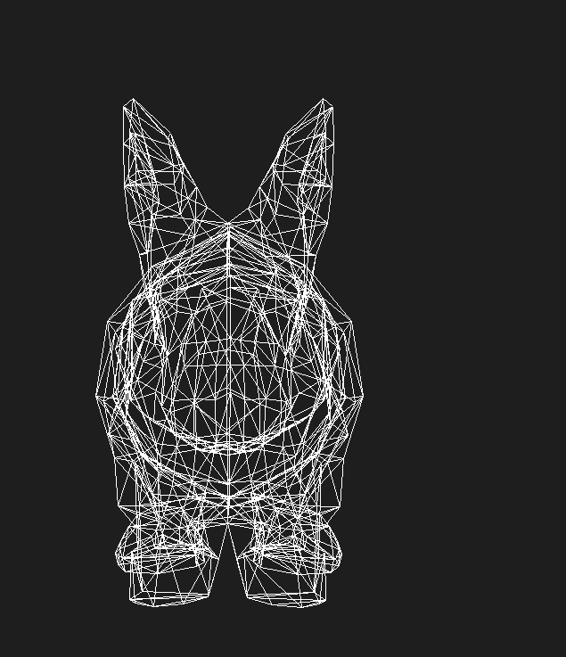

**camera far / frustrum big**

Here, the object looks more like 2D as the distance between the camera and the object is very big so the difference in the point of view between looking at the head and the tail is negligible so we get less of a 3D effect.

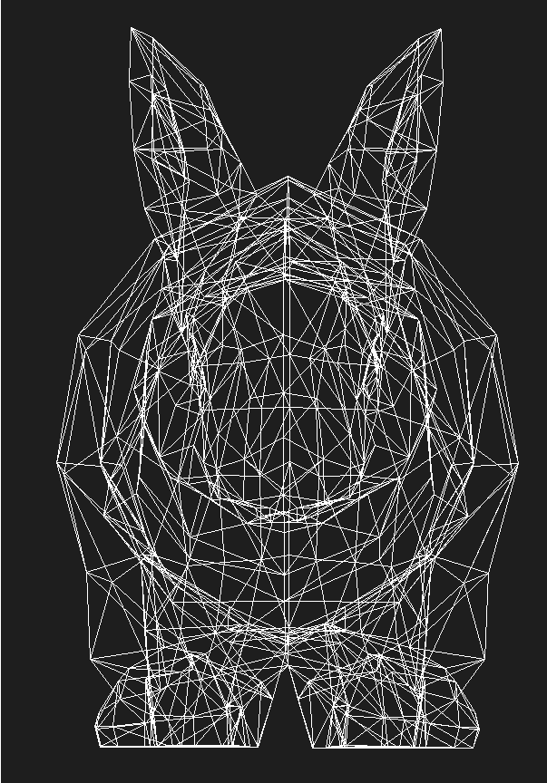

##

Rotate the camera around its axis:

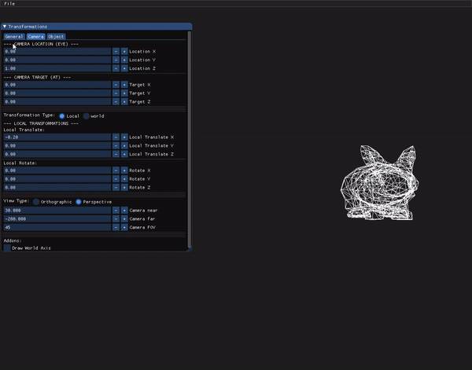

Rotate the camera around the world axis:

Here we can clearly see the difference as the camera rotates around all the world and not around its axis. That means the world stays in place as the camera rotates around it.

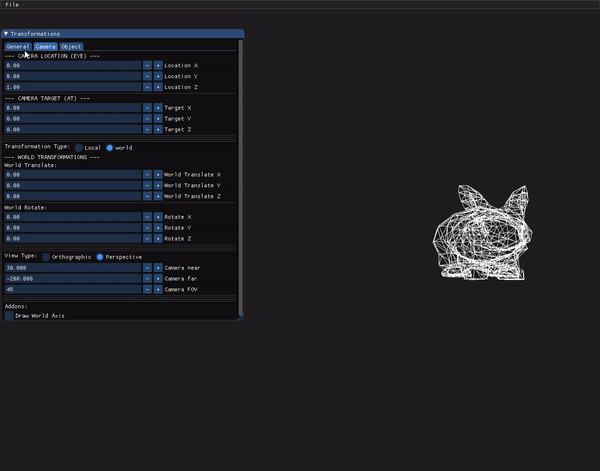

##

Here we put the camera location at (1, 1, 1) and set the view target to (0, 0, 0). Now he get an "up view" as we are looking from the (1, 1, 1) point.

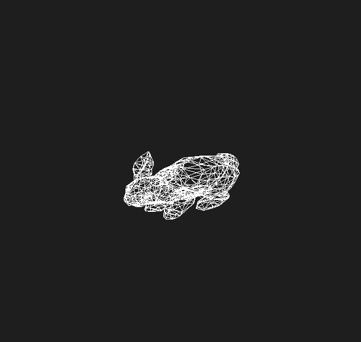

---

##

We implemnted the incremental function witch we called "IncrementalTrans",
it works by pressing ,"L" (translate right) or "J" (translate left).

We calculated the inverse matrix of the transformaion and we multiply it with the inverse of the previous transformations.
the multiplication order:
inverse(previous transformations)\*inverse (transformaion)

##

---

Here is a screenshot of adding 2 Cameras:

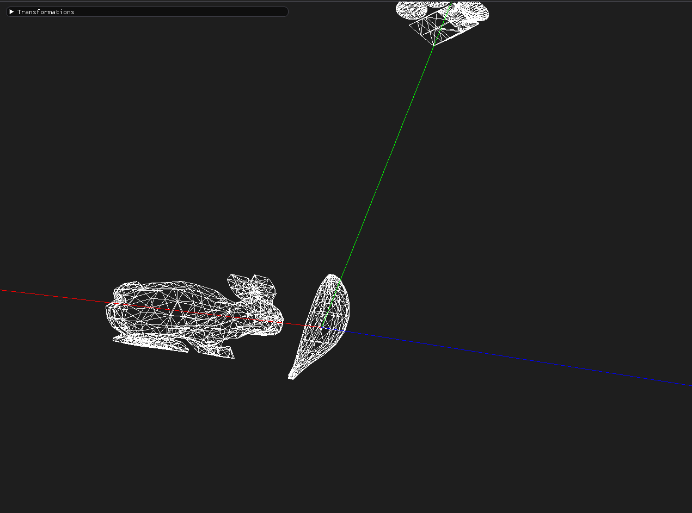

We also shot a video of the two cameras:

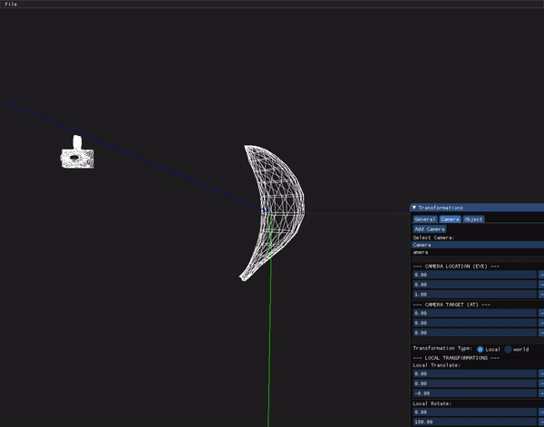
