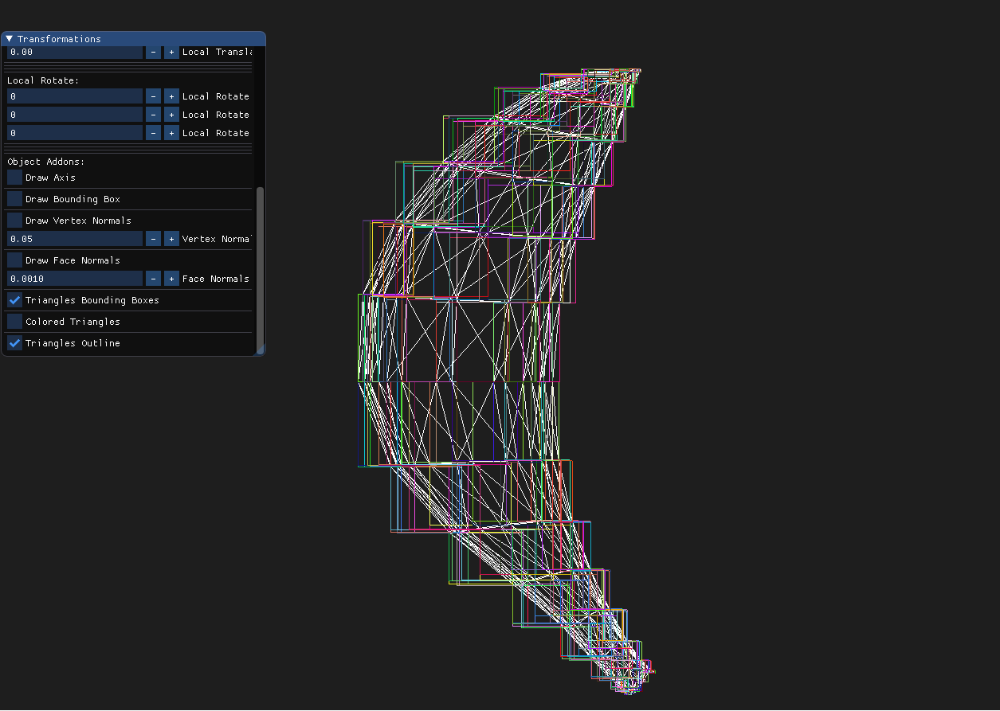
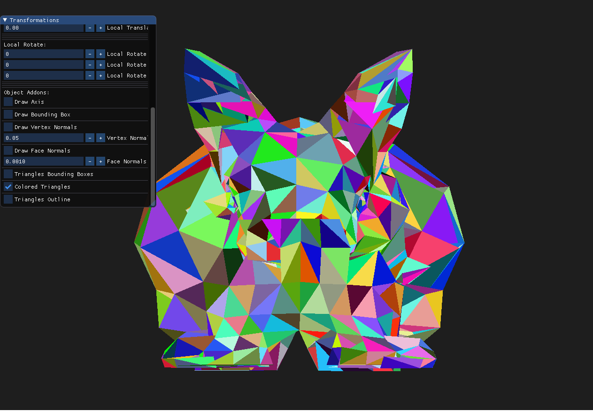
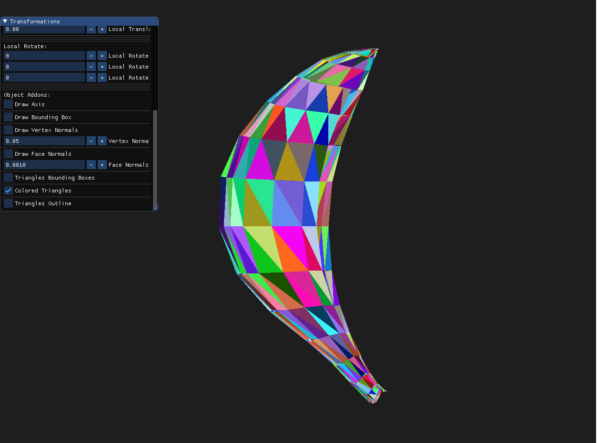
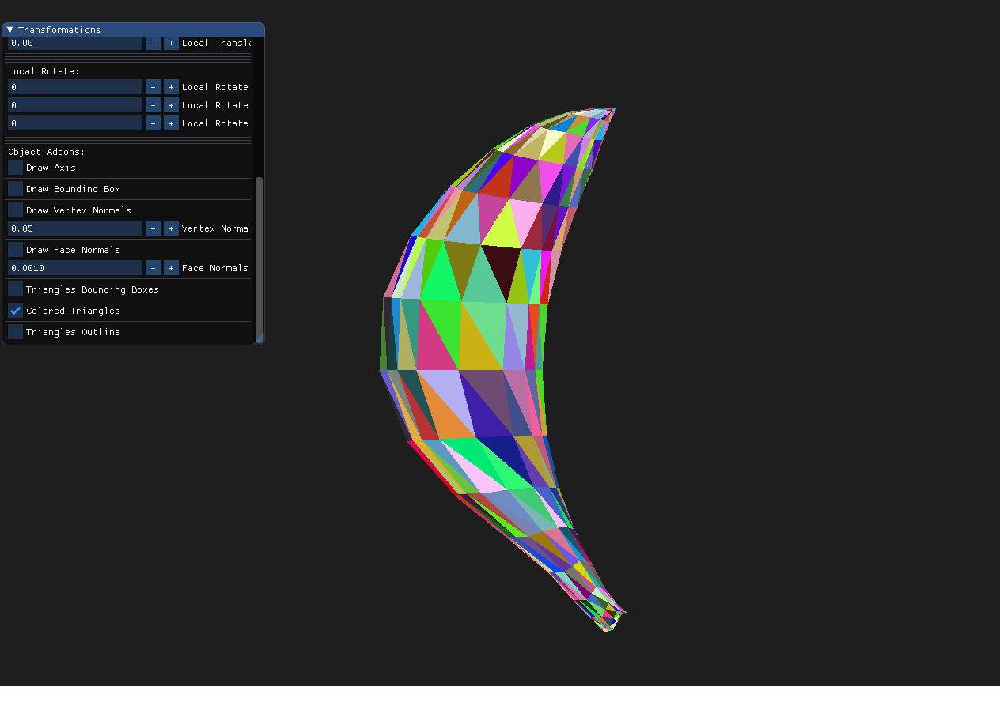
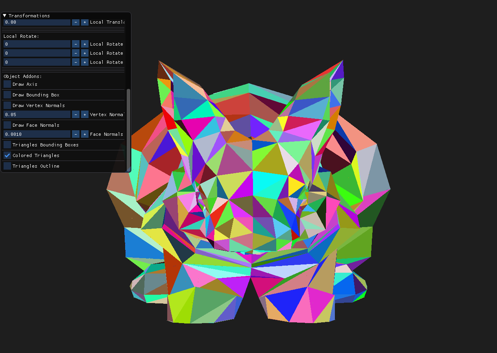
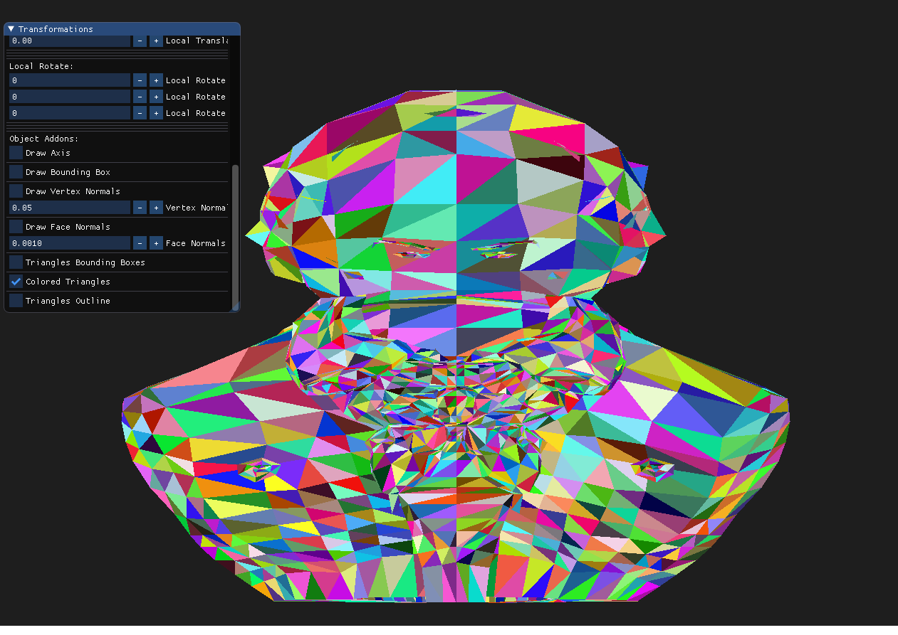
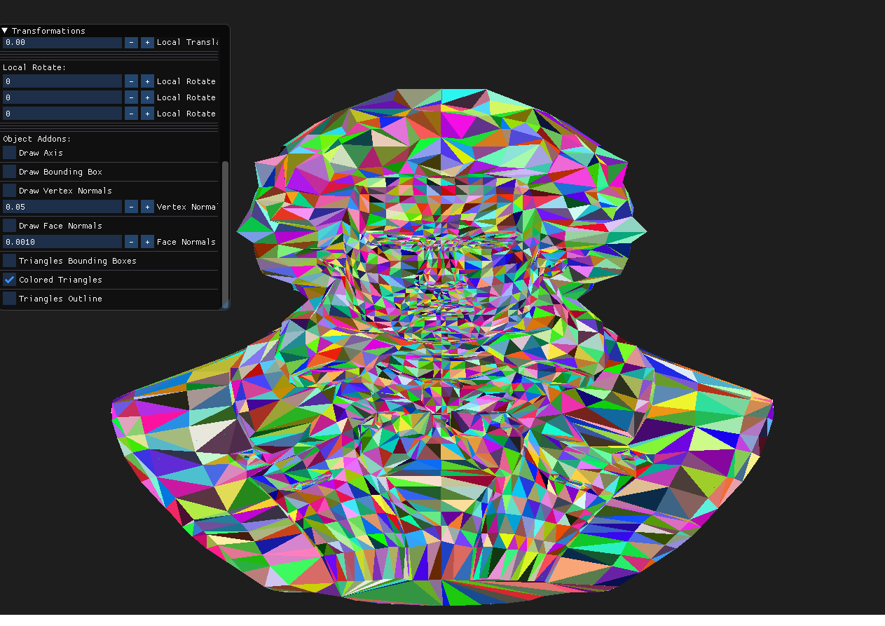
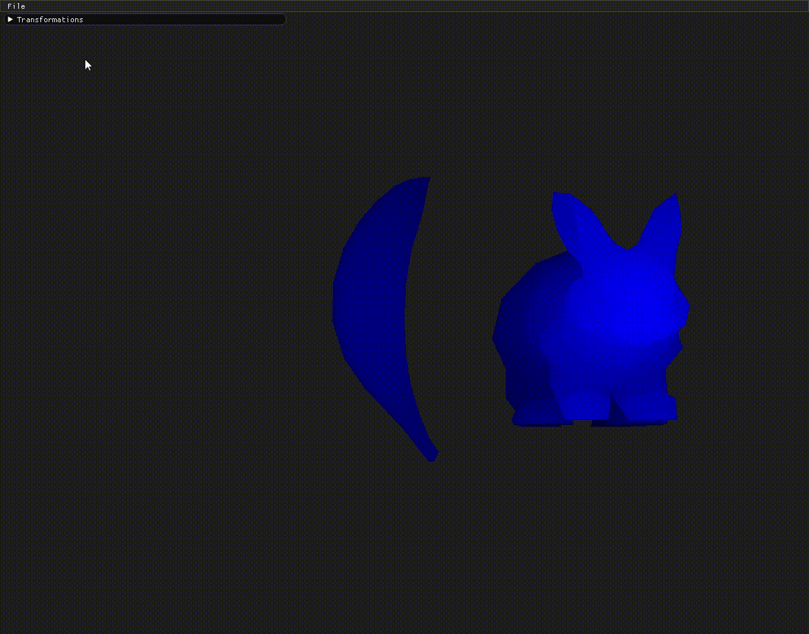

# Assignment2Report-part1

First, we implemented the ability to draw a bounding box for each triangle.

Here is an example of the bounding box :

##

Then, we implemented the ability to color each of the model's triangles. We chose to implement the scanline approach. Here is an example of the output:

##

Finally, we implemented the z_buffer. Here are the differences between using the z_buffer and not using it:

We can clearly see that only the triangles that are near the camera are colored so we can see the model more clearly. Also, the priority is given to the triangles that are closer to the camera.

We implemented the gray scale approach we talked about in the lecture where pixels are colored using a linear interpolation between the chosen color and a darker color as we get further back from the camera.

**banana without z_buffer:**

**banana with z_buffer:**

##

**bunny without z_buffer:**

**bunny with z_buffer:**

##

**bethoven without z_buffer:**

**bethoven with z_buffer:**

**colors linear interpolation:**

