# Assignment2Report-part2

First, we started making a new class for the light source. We added 3 RGB values, one for the ambient light, one for the diffuse light and one for the specular light.

We also added 3 RGB values to the mesh model as these represent the material of the object.

```c++
    glm::vec3 ambientColor = glm::vec3(1.0f, 1.0f, 1.0f);
	glm::vec3 diffuseColor = glm::vec3(1.0f, 1.0f, 1.0f);
	glm::vec3 specularColor = glm::vec3(1.0f, 1.0f, 1.0f);
```

Then, we ran the program and we got the following output:

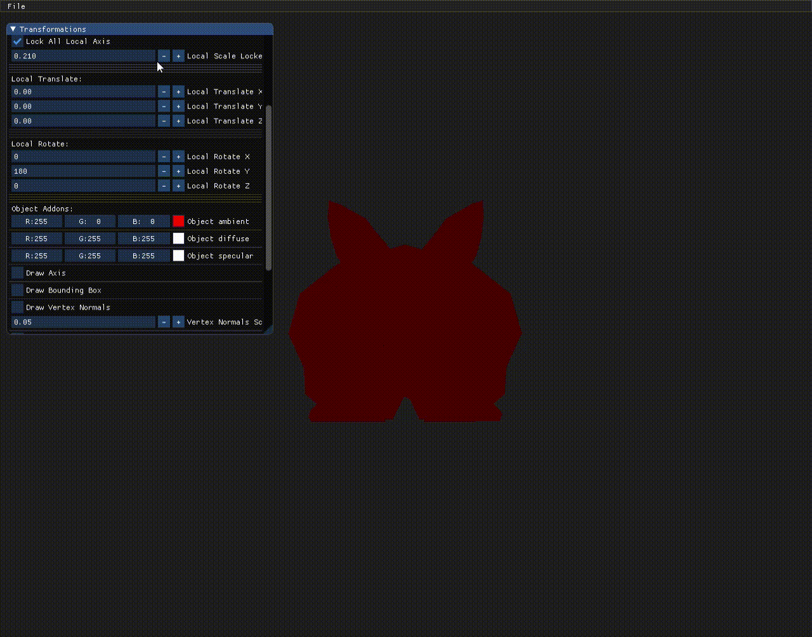

We also saw the effect of the object material color. We set it's ambient color material to red (1, 0, 0) so that only the red component of the light gets displayed. We can see from the gif below that the light color is green but the object color is red as only the red component of the light is being displayed by the object:

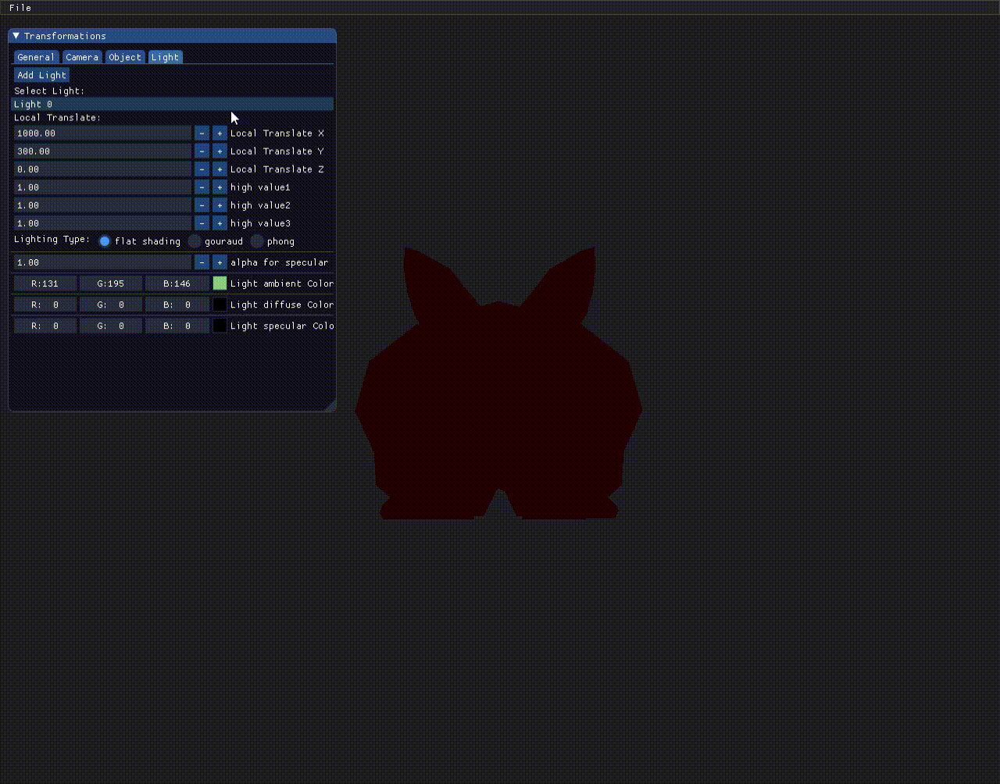

Now we calculated the diffuse component and added it to the color:

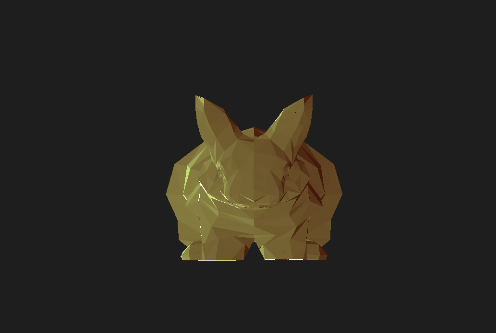

Now, we added the gouroud shading and the difference is clear. We can se that the object is smoother around the edges of the triangles as it makes a smooth transition between the colors of neighboring pixels.

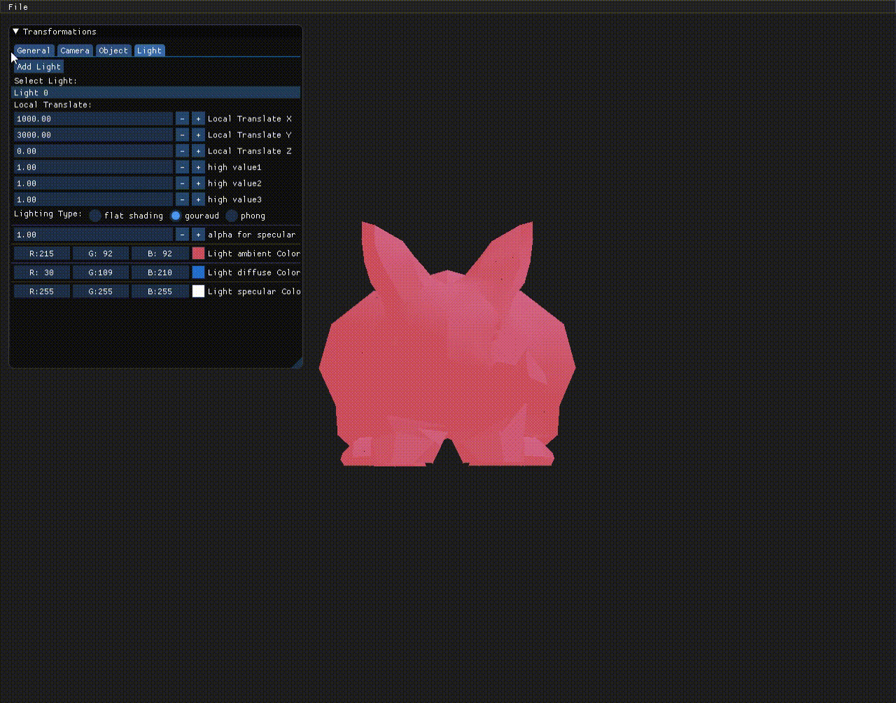

Then, we implemented the phong shading with the specular light (we used the equations in the slides to calculate all the light reflections and intensity for all shading components).

We have drawn the reflection direction of each face as seen below:

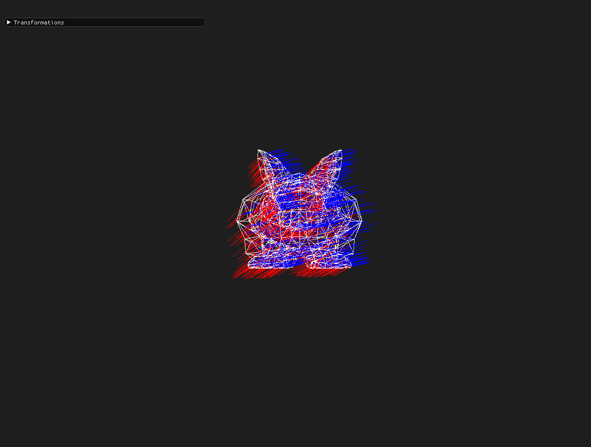

This is the result of the phong shading. We can clearly see the effect of the alpha which is the specular intensity, it changes the object's reflection intensity from a "mirrory" look to a more "matte" look.

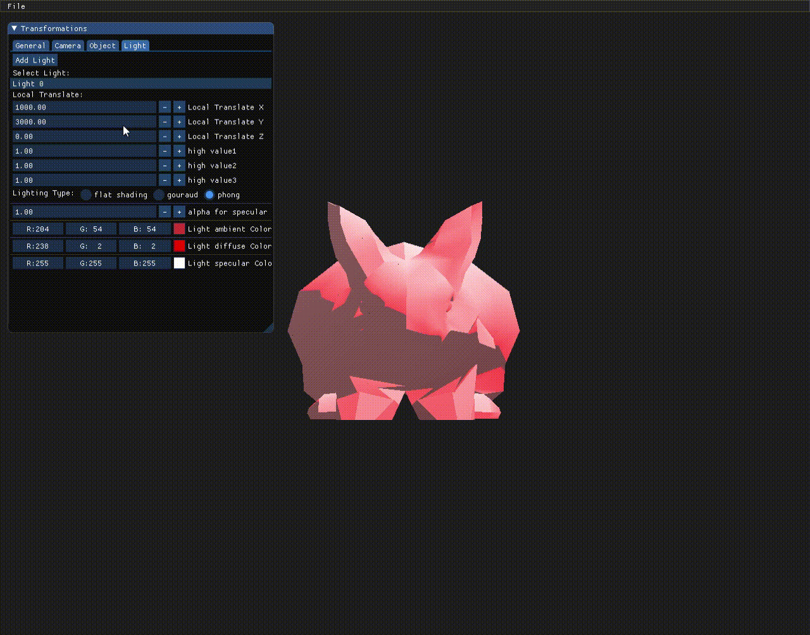

We implemented a directional light. As we saw in the lecture, a directional light has the same effect as a point light projecting from infinity. This is the way we implemented this effect. We put the light at (inf, 0) coordinates and got this result:
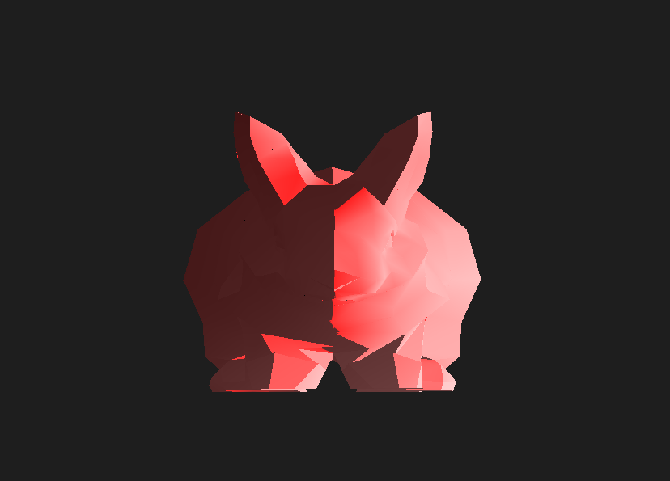

These are examples of the different lighting effects with defferent models:

## Flat Shading:

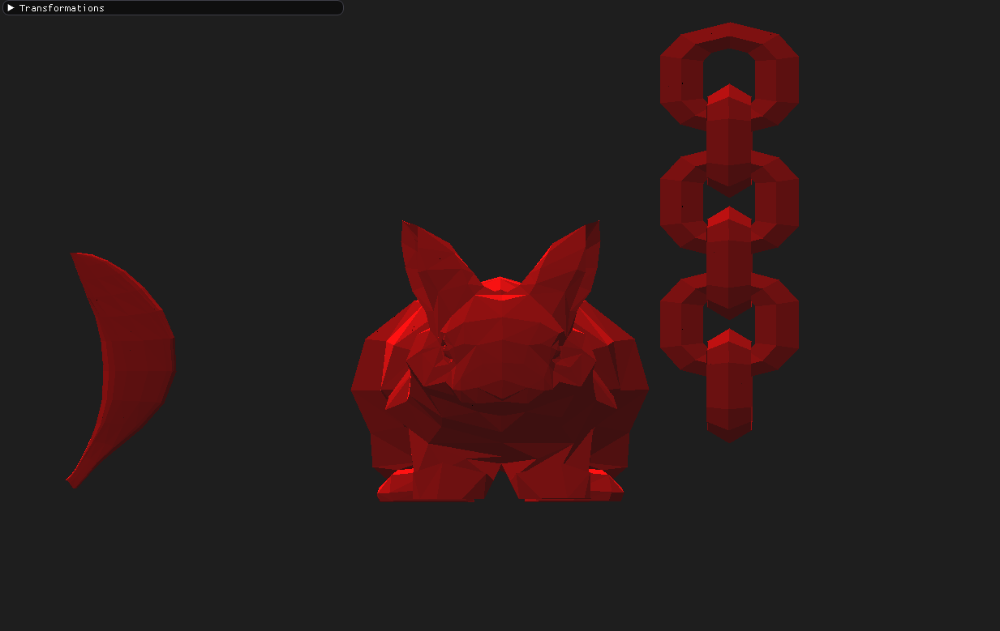

## Gouroud Shading:

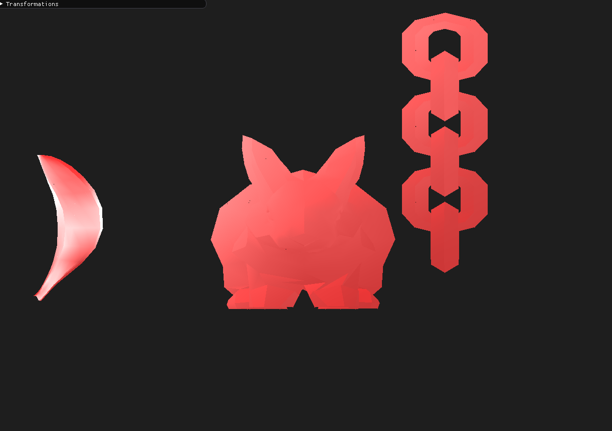

## Phong Shading:

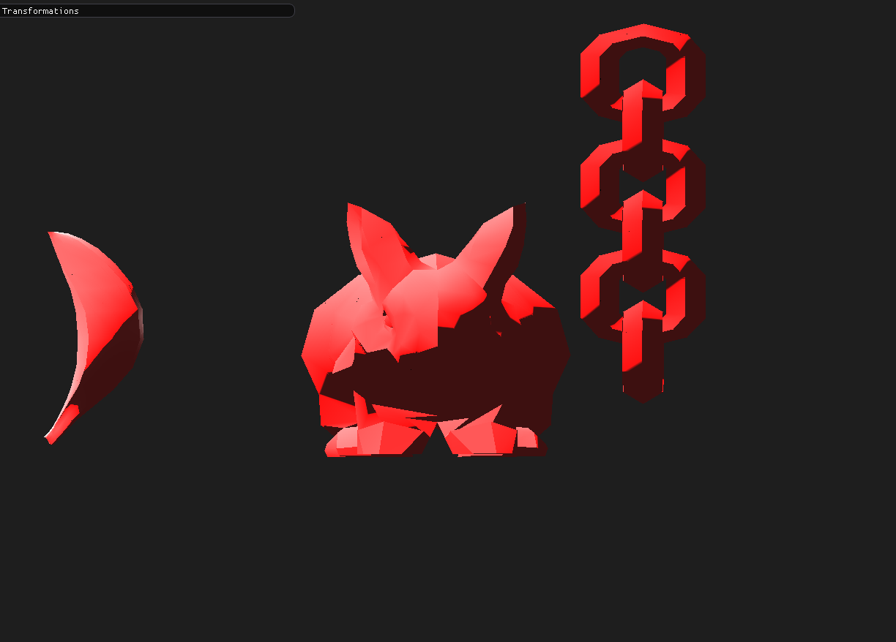

We IMplemented two post-processing effects:

## Linear Fog:

We can clearle see the difference when we change the z value of the banana.

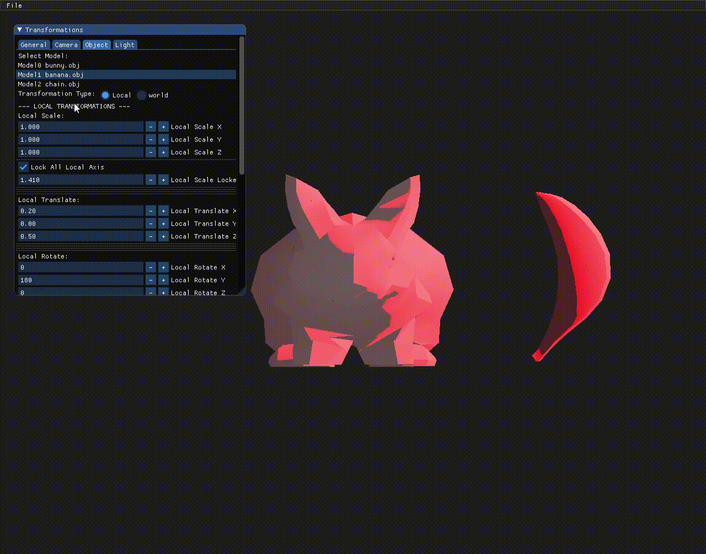

## MSAA:

We added the MSAA Effect between the 8 neighbors of the pixel. We gave different weights to each pixel color according to its sdistance from the current pixel.

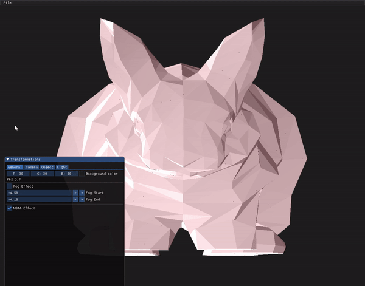

We added the ability to turn on-off the effects and change some parameters to fit the user's needs (As seen in the last gif).
