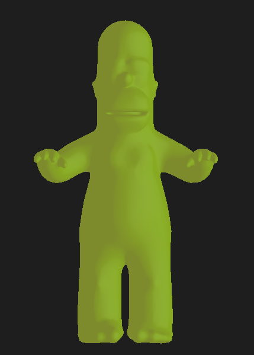
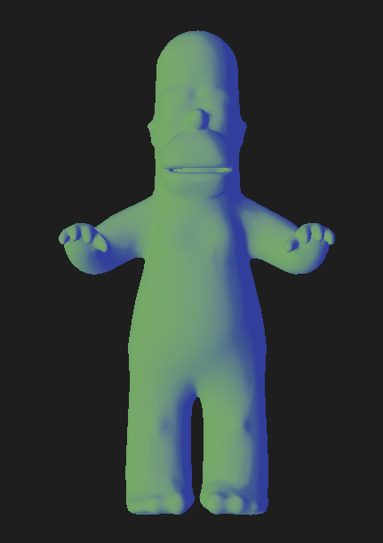
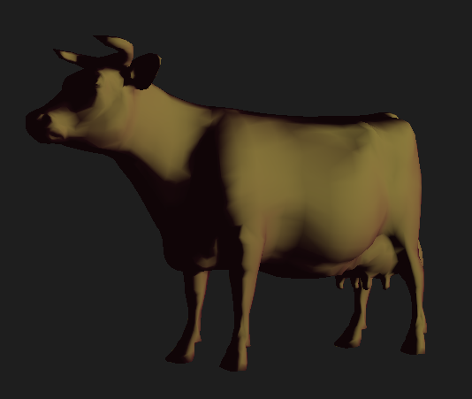
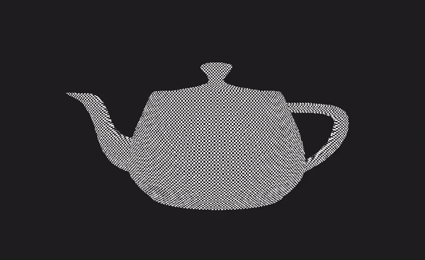
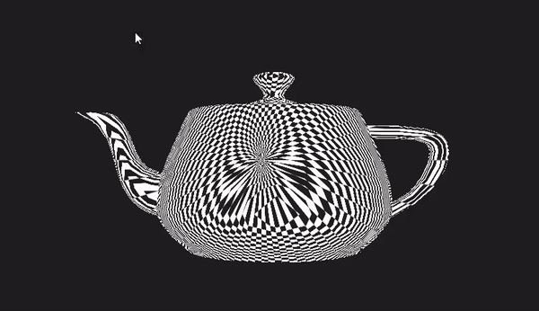
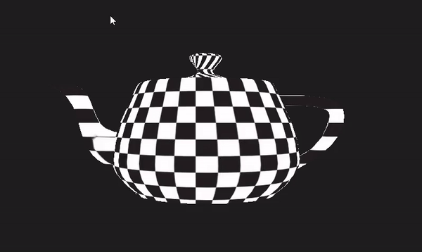
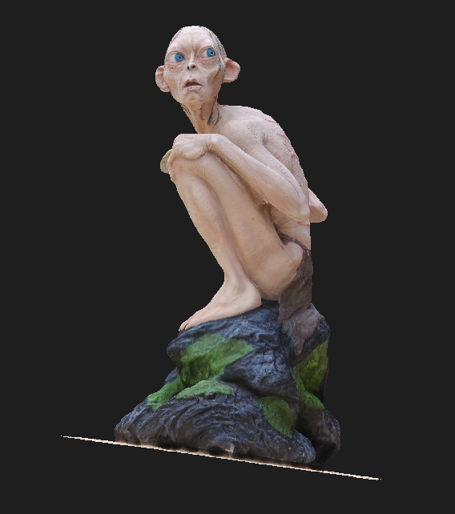
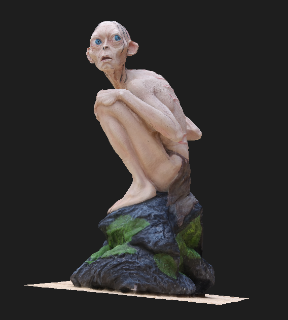
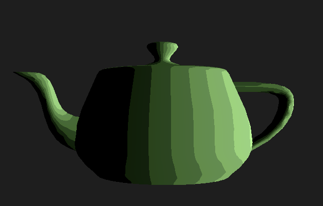

# Assignment3Report

## 1.

First, it creates a unique identifier for an opengl texture and for a vertex array object (VAO).
Then, it creates a buffer, and copies the vertex and texture coordinates data to it.
Finally, it creates a shader program, and tells the shader where to look for the vertex position data, and the data dimensions.

## 2.

First, we started my loading the mesh model to the GPU.

## 3.

This is the code for the vShader:

```c++
 #version 330 core

layout(location = 0) in vec3 pos;
layout(location = 1) in vec3 normal;
layout(location = 2) in vec2 texCoords;

uniform mat4 model;			// model transformations
uniform mat4 camera;		// camera transformations
uniform mat4 projection;	// camera projection

// These outputs will be available in the fragment shader as inputs
out vec3 orig_fragPos;
out vec3 fragPos;
out vec3 fragNormal;
out vec2 fragTexCoords;

void main()
{
	orig_fragPos = pos, 1.0f;
	fragPos = vec3(model * vec4(pos, 1.0f));
	fragNormal = vec3(model * vec4(normal, 1.0f));

	fragTexCoords = texCoords;

	gl_Position = projection * camera *  model * vec4(pos, 1.0f);
}
```

## 4.

We implemented a simple fragment shader that outputs a constant color.

```c++
#version 330 core

// Inputs from vertex shader (after interpolation was applied)
in vec3 fragPos;
in vec3 fragNormal;
in vec2 fragTexCoords;
in vec3 orig_fragPos;

// The final color of the fragment (pixel)
out vec4 frag_color;

void main()
{
	frag_color = vec4(vec3(0.0f, 0.0f, 1.0f),1);
}

```

## 5.

Here, we loaded all the variables and parameters to the GPU.

```c++
colorShader.setUniform("model", currentModel->GetWorldTransformation() *currentModel->GetModelTransformation());
colorShader.setUniform("camera", camera.GetViewTransformation());
colorShader.setUniform("projection", camera.GetProjectionTransformation());
colorShader.setUniform("material.textureMap", 0);

colorShader.setUniform("material.objAmbientColor", currentModel->ambientColor);
colorShader.setUniform("material.objDiffuseColor", currentModel->diffuseColor);
colorShader.setUniform("material.objSpecularColor",currentModel->specularColor);

colorShader.setUniform("material.lightAmbientColor", scene->GetLigh(0->ambientColor);
colorShader.setUniform("material.lightDiffuseColor", scene->GetLigh(0->diffuseColor);
colorShader.setUniform("material.lightSpecularColor", scene->GetLigh(0->specularColor);
colorShader.setUniform("material.alpha", scene->GetLight(0)->alpha);

colorShader.setUniform("material.lightPos", scene->GetLight(0)->GetPosition());
colorShader.setUniform("material.eye", camera.GetEye());
```

## 6.

Demonstrating Phong lighting on "homer.obj".




## 7.

## _plane mapping:_



## _cylindrical mapping:_



## _spherical mapping:_



## _Here is an example of the texture mapping with a texture map:_



## 8.

## _normal mapping:_

We used the equation from the lecture slides to calculate the normal map.
We can see that the object has a slight depth effect on the texture.


## _toon shading:_

Here we used 5 levels of shading to create a cartoon effect.

